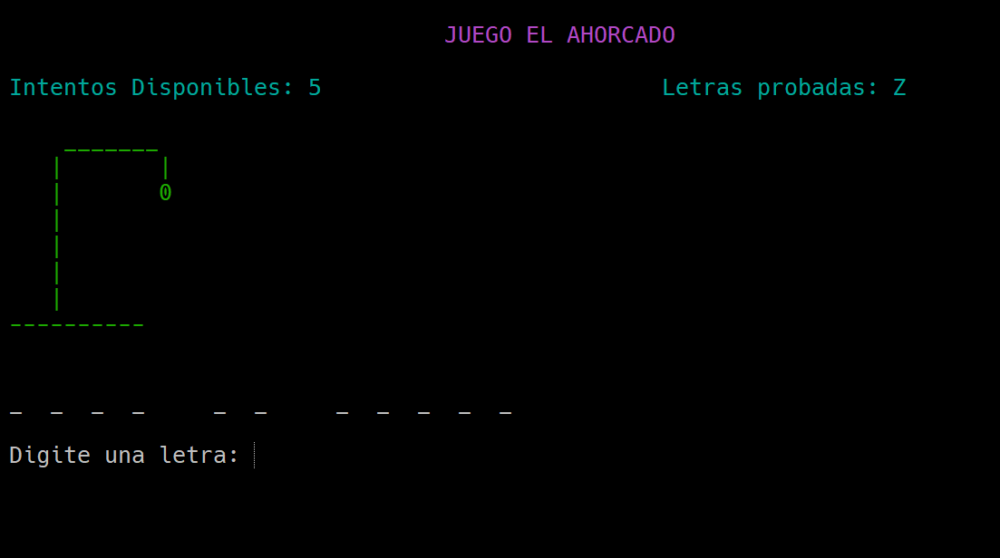
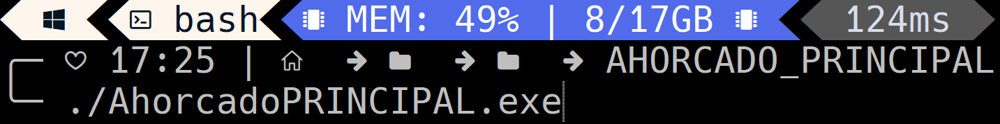
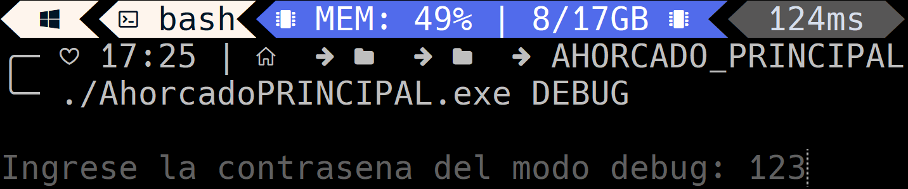

# Juego el Ahorcado
 

Licenciatura en Informática 
Sede Puerto Madryn 
Algorítmica y Programación I</u> 
Fecha: 27/11/2023   
Trabajo Integrador Nº2 - "Juego el Ahorcado" 
Alumnos: 
Andres, Ariel Sebastian. 
Bonansea Camaño, Mariano Nicolas. 
Cordoba,Tahiel Luis. 
Rivero, Lucia Jazmin. 

 
 
 
 
 
 
Preview: 
 
Instrucciones de ejecucion: 
1. Ubicarse en la carpeta "/AHORCADO_PRINCIPAL" 
2. Ejecutar el juego en alguno de sus modos: 
* Modo con idioma deffault (./AhorcadoPRINCIPAL.exe): 
 
* Modo DEBUG (contraseña: 123) (./AhorcadoPRINCIPAL.exe DEBUG): 
 
* Modo con idioma por parametros (./AhorcadoPRINCIPAL.exe Idiomas/"idiomaElegido.dat"): 
 

